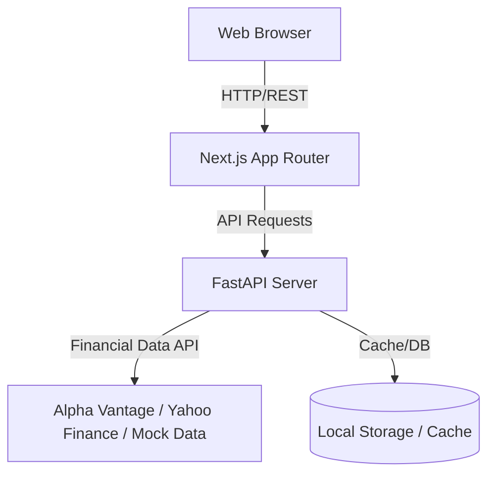

# Architecture Overview

This document provides a high-level overview of the Stock Market Analyzer application's architecture.

## System Design

The project follows a decoupled client-server architecture consisting of two main components:

1. **Frontend**: Next.js (React) application
2. **Backend**: FastAPI (Python) service

## Technologies

### Frontend

- **Framework**: Next.js 14+ (App Router)
- **Language**: TypeScript
- **Styling**: Tailwind CSS
- **Charting**: Recharts
- **Icons**: Lucide React

### Backend

- **Framework**: FastAPI
- **Language**: Python 3.9+
- **Server**: Uvicorn
- **Validation**: Pydantic
- **Data Gathering**: Custom Python Services using standard HTTP libraries

## Detailed Component Interactions

### Frontend Layer

- Uses React Server Components (where applicable) and Client Components for interactivity.
- Maintains global state and efficiently orchestrates UI updates.
- Calls the `/api/v1/stocks/...` endpoints to retrieve historical data.
- Handles responsive layouts relying on Tailwind's utility-first classes.

### Backend Layer

- Exposes modular routes (e.g., `app/routes/stock.py`).
- Routes pass requests down to specialized services (e.g., `app/services/stock_service.py`) representing the core business logic layer.
- Returns standardized JSON payloads defined strictly via Pydantic model schemas.

## Data Flow

1. User interacts with the Timeframe Selector on the front end.
2. The UI component triggers an asynchronous fetch request to `http://localhost:8000/api/v1/stocks/AAPL/history?timeframe=1M`.
3. Next.js routes this to the FastAPI backend.
4. FastAPI validates parameters.
5. The `stock_service` aggregates / fetches the corresponding historical chunks.
6. The service returns data to the router, which serializes into JSON.
7. Next.js receives the data and updates the Recharts instance seamlessly.
